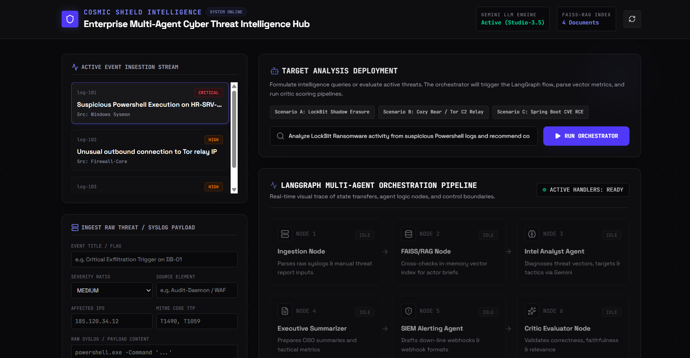
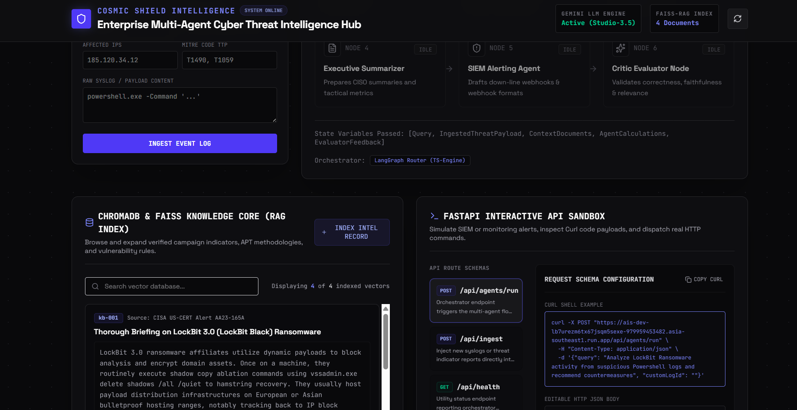
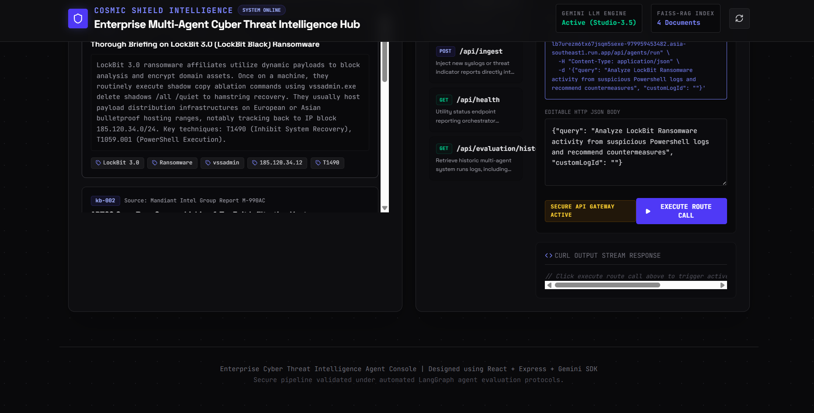

# Enterprise Multi-Agent Cyber Threat Intelligence Agent

An enterprise-grade **multi-agent cyber threat intelligence platform** that combines **LangGraph orchestration, FAISS-powered Retrieval-Augmented Generation (RAG), FastAPI services, and specialized AI agents** to analyze cyber threats, enrich intelligence, and automate security workflows.

The system ingests threat reports, suspicious logs, and adversarial indicators, retrieves contextual intelligence through vector search, routes findings between specialized agents, and produces actionable security recommendations.

---

## Preview

<p align="center">
  
</p>

---

## Problem Statement

Security teams are overwhelmed by:

- Massive incoming threat intelligence feeds
- Manual threat correlation
- Slow incident triage
- Fragmented detection systems
- Limited contextual enrichment

Traditional workflows require analysts to manually:

1. Investigate logs  
2. Search threat databases  
3. Correlate MITRE ATT&CK mappings  
4. Summarize findings  
5. Generate alerts

This platform automates that pipeline using **AI-driven multi-agent orchestration**.

---

## Key Features

### Multi-Agent Threat Intelligence Pipeline
Specialized agents collaborate to:

- Analyze suspicious activity
- Enrich threat intelligence
- Summarize incident findings
- Generate alerts
- Validate reasoning quality

### Retrieval-Augmented Generation (RAG)
Threat intelligence retrieval using:

- **FAISS Vector Database**
- **ChromaDB**
- Embedded threat documents
- MITRE ATT&CK mappings

### LangGraph Agent Orchestration
Dynamic state-based orchestration between agents:

- Ingestion Agent
- Intelligence Analyst Agent
- Executive Summarizer
- SIEM Alerting Agent
- Critic Evaluation Agent

### FastAPI Security Layer
Production-ready API endpoints for:

- Threat ingestion
- Monitoring integrations
- Security orchestration
- Incident pipelines

### Evaluation & Validation Pipeline
Automatically scores agent outputs for:

- Accuracy
- Context relevance
- Threat consistency
- Response quality

---

## System Workflow

```text
Threat Logs / Threat Reports
              ↓
      Threat Ingestion Layer
              ↓
     FAISS + ChromaDB Retrieval
              ↓
     LangGraph Agent Router
              ↓
 ┌─────────────────────────────┐
 │ Intelligence Analyst Agent  │
 │ Executive Summarizer        │
 │ SIEM Alerting Agent         │
 │ Critic Evaluation Agent     │
 └─────────────────────────────┘
              ↓
     Security Recommendations
              ↓
        FastAPI Endpoints
```

---

## Tech Stack

| Category | Technologies |
|----------|--------------|
| Language | Python |
| Agent Framework | LangGraph |
| RAG | FAISS, ChromaDB |
| API | FastAPI |
| LLM | Gemini / OpenAI Compatible Models |
| Orchestration | Multi-Agent Routing |
| Security | MITRE ATT&CK |
| Backend | REST APIs |
| Evaluation | Custom Scoring Pipeline |

---

# System Walkthrough

## 1. Multi-Agent Threat Orchestration Pipeline

This module acts as the central intelligence hub.

It:

- Ingests suspicious threat logs
- Routes execution across agents
- Tracks state transfers
- Performs autonomous threat analysis

<p align="center">
  
</p>

---

## 2. Threat Intelligence Retrieval using RAG + FAISS

Threat reports are retrieved through a vector intelligence layer.

Capabilities include:

- Semantic search
- Threat actor correlation
- MITRE ATT&CK enrichment
- Malware intelligence retrieval
- Context grounding

<p align="center">
  
</p>

---

## 3. FastAPI Threat Intelligence API Sandbox

A production-ready API interface exposes the platform for integration into:

- SIEM systems
- Monitoring pipelines
- Detection systems
- Security automation workflows

Supported endpoints include:

```http
POST /api/agents/run
POST /api/ingest
GET /api/health
GET /api/evaluation/history
```

<p align="center">
  
</p>

---

## Multi-Agent Architecture

```text
                    ┌─────────────────────┐
                    │ Threat Logs / IOC   │
                    └──────────┬──────────┘
                               │
                    Threat Ingestion Agent
                               │
                     FAISS / ChromaDB RAG
                               │
                    LangGraph Router Engine
                               │
      ┌──────────────┬──────────────┬──────────────┐
      │              │              │              │
 Intel Analyst   Executive      SIEM Alert      Critic
 Agent           Summarizer     Generator       Evaluator
      │              │              │              │
      └──────────────┴──────────────┴──────────────┘
                               │
                     Final Threat Intelligence
                               │
                        FastAPI Endpoints
```

---

## Security Capabilities

- Threat Intelligence Enrichment
- MITRE ATT&CK Mapping
- IOC Correlation
- Malware Behavior Analysis
- Automated Threat Summaries
- Multi-Agent Decision Routing
- Security Alert Generation

---

## Results & Impact

This system enables security teams to:

- Reduce manual threat triage effort
- Automate intelligence enrichment
- Improve incident response speed
- Generate explainable threat reports
- Scale cyber intelligence workflows

---

## Future Improvements

- Real-time SIEM integration
- Kafka event streaming
- Threat actor attribution graph
- Malware similarity search
- Autonomous SOC analyst agent
- Kubernetes deployment

---
